# 组件详细说明

## 🏗️ 四层架构组件

MCP Feedback Enhanced 采用清晰的四层架构设计，每层负责特定的功能领域。本文档详细说明各层组件的实现细节、职责分工和交互机制。

### 架构设计原则

- **单一职责**: 每个组件专注于特定功能领域
- **低耦合**: 层间通过明确的接口通信
- **高内聚**: 相关功能集中在同一层内
- **可扩展**: 支持新功能的无缝集成
- **可测试**: 每层都可独立进行单元测试

### 详细组件关系图

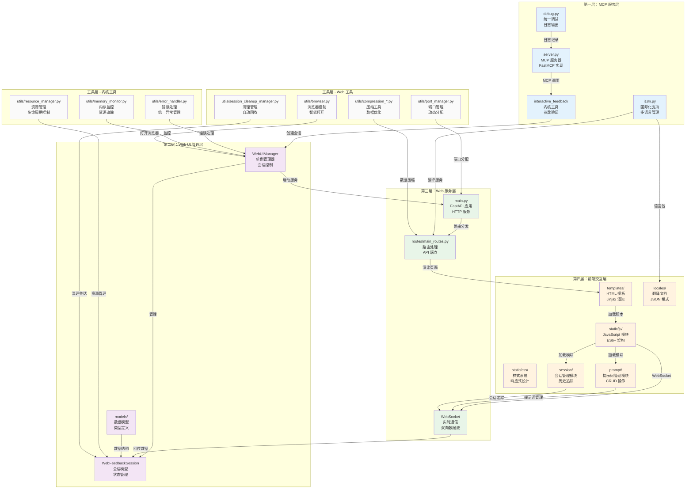

## 🔧 第一层：MCP 服务层

### server.py - MCP 服务器内核

**架构实现**：
```python
# 基于 FastMCP 的服务器实现
mcp = FastMCP("mcp-feedback-enhanced")

@mcp.tool()
async def interactive_feedback(
    project_directory: Annotated[str, Field(description="项目目录路径")] = ".",
    summary: Annotated[str, Field(description="AI 工作完成的摘要说明")] = "我已完成了您请求的任务。",
    timeout: Annotated[int, Field(description="等待用户回馈的超时时间（秒）")] = 600,
) -> list:
    """
    收集用户的交互回馈，支持文本和图片
    """
    # 1. 参数验证和环境检测
    # 2. 启动 Web UI 管理器
    # 3. 创建或更新会话
    # 4. 等待用户回馈
    # 5. 处理和返回结果
```

**主要职责**：
- **MCP 协议实现**: 基于 FastMCP 框架的标准实现
- **工具注册**: 注册 `interactive_feedback` 和 `get_system_info` 工具
- **环境检测**: 自动识别 Local/SSH Remote/WSL 环境
- **生命周期管理**: 控制 Web UI 的启动、运行和清理
- **接口层**: 作为 AI 助手与系统的主要通信接口

**内核特性**：
- 支持 MCP 2.0+ 协议标准
- 异步处理提升性能
- 完整的错误处理和日志记录
- 参数类型验证和文档生成

### interactive_feedback 工具

**工具运行流程**：
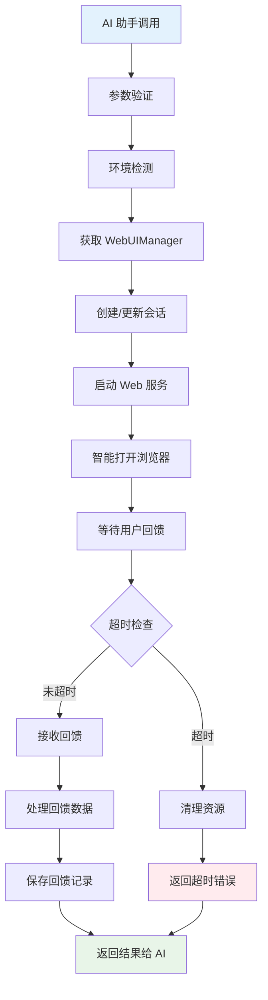

**参数说明**：
- `project_directory`: 项目目录路径，用于命令运行上下文
- `summary`: AI 工作摘要，显示给用户确认
- `timeout`: 等待超时时间，缺省 600 秒（10 分钟）

**返回格式**：
```python
# 成功返回
[
    TextContent(type="text", text="用户回馈内容"),
    MCPImage(data="base64_encoded_image", mimeType="image/png")  # 可选
]

# 错误返回
[TextContent(type="text", text="错误描述")]
```

### i18n.py - 国际化支持

**多语言架构**：
```python
class I18nManager:
    def __init__(self):
        self._supported_languages = ["zh-TW", "en", "zh-CN"]
        self._fallback_language = "en"
        self._locales_dir = Path(__file__).parent / "web" / "locales"

    def t(self, key: str, **kwargs) -> str:
        """翻译函数，支持嵌套键值和参数替换"""
```

**内核功能**：
- **三语支持**: 繁体中文、简体中文、英文
- **智能检测**: 基于系统语言自动选择
- **动态切换**: 运行时语言切换无需重启
- **嵌套翻译**: 支持 `buttons.submit` 格式的键值
- **参数替换**: 支持 `{name}` 格式的动态内容
- **回退机制**: 翻译缺失时自动使用英文

**翻译文档结构**：
```json
{
    "app": {
        "title": "MCP Feedback Enhanced",
        "subtitle": "AI 辅助开发回馈收集器"
    },
    "buttons": {
        "submit": "提交回馈",
        "cancel": "取消"
    }
}
```

### debug.py - 统一调试系统

**调试功能**：
- **条件输出**: 只在 `MCP_DEBUG=true` 时输出
- **分类日志**: 不同模块使用不同前缀
- **安全输出**: 输出到 stderr 避免干扰 MCP 通信
- **编码处理**: 自动处理中文本符编码问题

**使用方式**：
```python
from .debug import server_debug_log as debug_log
debug_log("服务器启动完成")  # [SERVER] 服务器启动完成
```

## 🎛️ 第二层：Web UI 管理层

### WebUIManager - 内核管理器

**单例模式实现**：
```python
class WebUIManager:
    _instance: Optional['WebUIManager'] = None
    _lock = threading.Lock()

    def __new__(cls, *args, **kwargs):
        if cls._instance is None:
            with cls._lock:
                if cls._instance is None:
                    cls._instance = super().__new__(cls)
        return cls._instance

    def __init__(self, host: str = "127.0.0.1", port: int = 0):
        self.current_session: Optional[WebFeedbackSession] = None
        self.global_active_tabs: Dict[str, dict] = {}
        self.app: Optional[FastAPI] = None
        self.server_thread: Optional[threading.Thread] = None
        self.port_manager = PortManager()
```

**内核职责**：
- **会话管理**: 单一活跃会话的创建、更新、清理
- **服务器控制**: FastAPI 应用的启动、停止、重启
- **浏览器控制**: 智能打开浏览器，避免重复窗口
- **资源管理**: 自动清理过期资源和错误处理
- **状态同步**: 维护全局状态和标签页追踪

**关键方法**：
```python
async def create_session(self, project_dir: str, summary: str) -> str:
    """创建新会话或更新现有会话"""

async def smart_open_browser(self, url: str) -> bool:
    """智能打开浏览器，检测活跃标签页"""

def cleanup_session(self, reason: CleanupReason = CleanupReason.MANUAL):
    """清理会话资源"""

def get_server_url(self) -> str:
    """获取服务器 URL"""
```

**智能浏览器打开机制**：
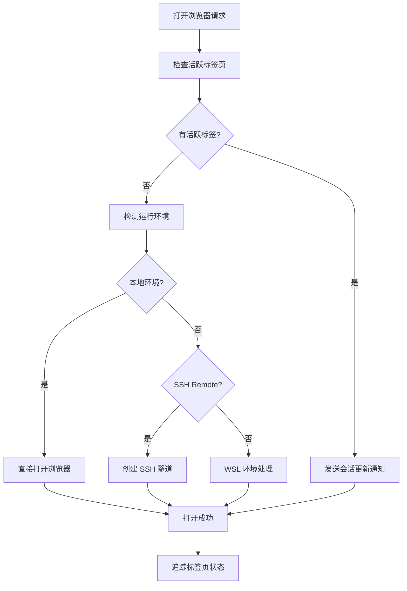

### WebFeedbackSession - 会话模型

**会话状态机**：
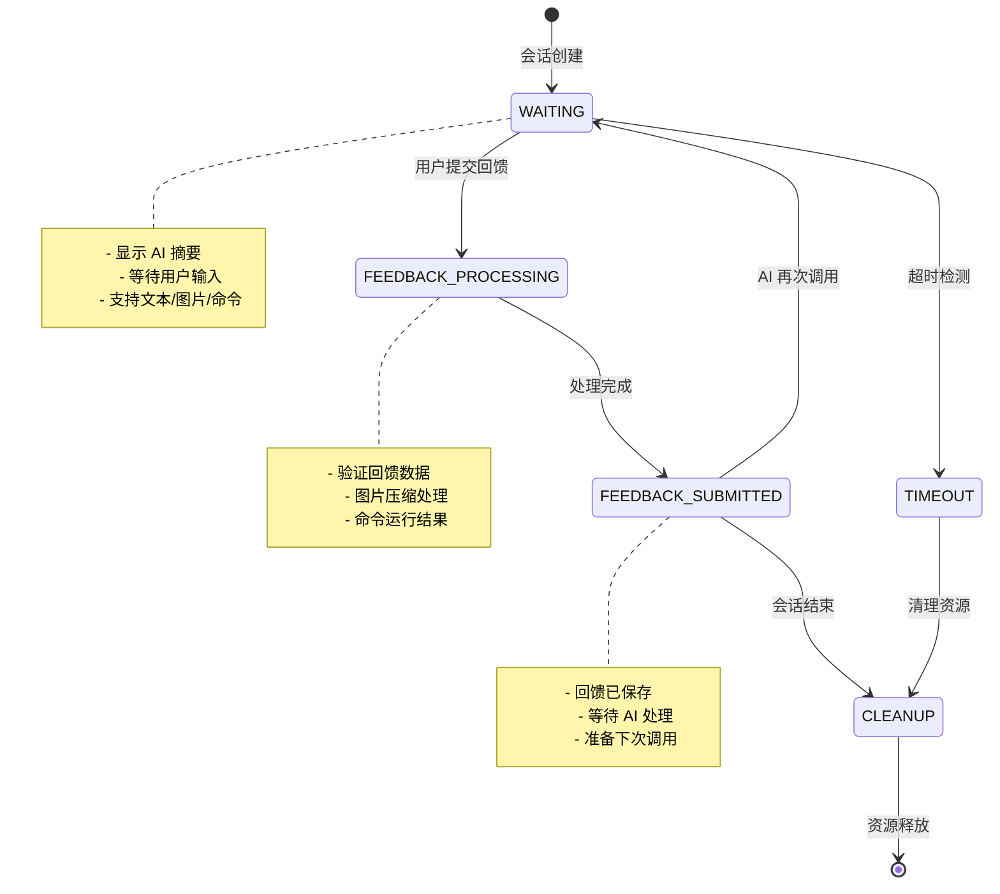

**会话数据结构**：
```python
@dataclass
class WebFeedbackSession:
    session_id: str
    project_directory: str
    summary: str
    status: SessionStatus
    created_at: datetime
    timeout: int
    feedback_future: Optional[asyncio.Future] = None

    # 回馈数据
    interactive_feedback: str = ""
    command_logs: str = ""
    images: List[Dict[str, Any]] = field(default_factory=list)

    async def wait_for_feedback(self, timeout: int) -> Dict[str, Any]:
        """等待用户回馈，支持超时处理"""

    def update_session(self, project_dir: str, summary: str, timeout: int):
        """更新会话内容，支持 AI 多次调用"""
```

**状态枚举**：
```python
class SessionStatus(Enum):
    WAITING = "waiting"                    # 等待用户回馈
    FEEDBACK_PROCESSING = "processing"     # 处理回馈中
    FEEDBACK_SUBMITTED = "submitted"       # 回馈已提交
    TIMEOUT = "timeout"                    # 会话超时
    ERROR = "error"                        # 发生错误
```

### models/ - 数据模型层

**FeedbackResult 模型**：
```python
@dataclass
class FeedbackResult:
    interactive_feedback: str = ""
    command_logs: str = ""
    images: List[Dict[str, Any]] = field(default_factory=list)
    session_id: str = ""
    timestamp: datetime = field(default_factory=datetime.now)

    def to_mcp_response(self) -> List[Union[TextContent, MCPImage]]:
        """转换为 MCP 协议格式"""
```

**CleanupReason 枚举**：
```python
class CleanupReason(Enum):
    TIMEOUT = "timeout"        # 超时清理
    MANUAL = "manual"          # 手动清理
    ERROR = "error"            # 错误清理
    SHUTDOWN = "shutdown"      # 系统关闭
```

**WebSocket 消息模型**：
```python
@dataclass
class WebSocketMessage:
    type: str                  # 消息类型
    data: Dict[str, Any]       # 消息数据
    session_id: Optional[str] = None
    timestamp: datetime = field(default_factory=datetime.now)
```

## 🌐 第三层：Web 服务层

### main.py - FastAPI 应用

**应用架构**：
```python
def create_app(manager: 'WebUIManager') -> FastAPI:
    """创建 FastAPI 应用实例"""
    app = FastAPI(
        title="MCP Feedback Enhanced",
        description="AI 辅助开发回馈收集系统",
        version="2.3.0"
    )

    # 设置中间件
    setup_middleware(app)

    # 设置路由
    setup_routes(manager)

    # 设置 WebSocket
    setup_websocket(app, manager)

    return app
```

**中间件配置**：
```python
def setup_middleware(app: FastAPI):
    # CORS 设置 - 允许本地开发
    app.add_middleware(
        CORSMiddleware,
        allow_origins=["http://127.0.0.1:*", "http://localhost:*"],
        allow_credentials=True,
        allow_methods=["*"],
        allow_headers=["*"],
    )

    # 静态文档服务
    app.mount("/static", StaticFiles(directory="static"), name="static")

    # 错误处理中间件
    @app.exception_handler(Exception)
    async def global_exception_handler(request, exc):
        return JSONResponse(
            status_code=500,
            content={"detail": f"内部服务器错误: {str(exc)}"}
        )
```

**内核功能**：
- **HTTP 路由处理**: RESTful API 端点
- **WebSocket 连接管理**: 实时双向通信
- **静态资源服务**: CSS、JS、图片等资源
- **模板渲染**: Jinja2 模板引擎
- **错误处理**: 统一的异常处理机制
- **安全配置**: CORS 和安全标头设置

### routes/main_routes.py - 路由处理

**路由架构图**：
```mermaid
graph TB
    subgraph "HTTP 路由"
        ROOT[GET /<br/>主页重定向]
        FEEDBACK[GET /feedback<br/>回馈页面]
        API_SESSION[GET /api/session<br/>会话信息]
        API_SETTINGS[GET/POST /api/settings<br/>设置管理]
        API_I18N[GET /api/i18n<br/>翻译资源]
        STATIC[/static/*<br/>静态资源]
    end

    subgraph "WebSocket 路由"
        WS[/ws<br/>WebSocket 连接]
        MSG_HANDLER[消息处理器]
        BROADCAST[广播机制]
    end

    subgraph "API 端点"
        SUBMIT[POST /api/submit-feedback<br/>提交回馈]
        COMMAND[POST /api/execute-command<br/>运行命令]
        UPLOAD[POST /api/upload-image<br/>图片上传]
        STATUS[GET /api/status<br/>系统状态]
    end

    ROOT --> FEEDBACK
    FEEDBACK --> API_SESSION
    WS --> MSG_HANDLER
    MSG_HANDLER --> BROADCAST
    SUBMIT --> MSG_HANDLER
    COMMAND --> MSG_HANDLER
    UPLOAD --> MSG_HANDLER
```

**主要路由端点**：

**页面路由**：
```python
@app.get("/")
async def root():
    """主页重定向到回馈页面"""
    return RedirectResponse(url="/feedback")

@app.get("/feedback")
async def feedback_page(request: Request):
    """回馈收集页面"""
    return templates.TemplateResponse("feedback.html", {
        "request": request,
        "project_directory": session.project_directory,
        "layout_mode": load_user_layout_settings()
    })
```

**API 路由**：
```python
@app.get("/api/session")
async def get_session():
    """获取当前会话信息"""

@app.post("/api/submit-feedback")
async def submit_feedback(feedback_data: dict):
    """提交用户回馈"""

@app.post("/api/execute-command")
async def execute_command(command_data: dict):
    """运行用户命令"""

@app.post("/api/upload-image")
async def upload_image(file: UploadFile):
    """处理图片上传"""
```

**WebSocket 消息类型**：
- `connection_established`: 连接创建确认
- `session_updated`: 会话内容更新
- `submit_feedback`: 提交回馈数据
- `feedback_received`: 回馈接收确认
- `status_update`: 系统状态更新
- `error_occurred`: 错误通知
- `command_result`: 命令运行结果
- `image_uploaded`: 图片上传完成

**WebSocket 连接管理**：
```python
@app.websocket("/ws")
async def websocket_endpoint(websocket: WebSocket):
    await websocket.accept()
    try:
        while True:
            data = await websocket.receive_json()
            await handle_websocket_message(websocket, data)
    except WebSocketDisconnect:
        await handle_disconnect(websocket)
```

## 🎨 第四层：前端交互层

### 新功能模块架构

#### 提示词管理模块群组 (prompt/)

**模块结构**：
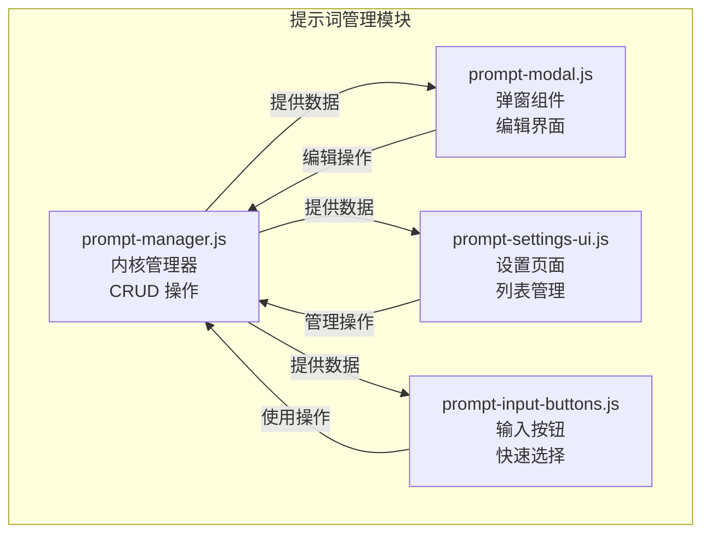

**内核功能**：
- **PromptManager**: 提示词的增删改查、排序、自动提交标记
- **PromptModal**: 添加/编辑提示词的弹窗界面
- **PromptSettingsUI**: 设置页签中的提示词管理界面
- **PromptInputButtons**: 回馈输入区的快速选择按钮

#### 会话管理模块群组 (session/) - v2.4.3 重构增强

**模块结构**：
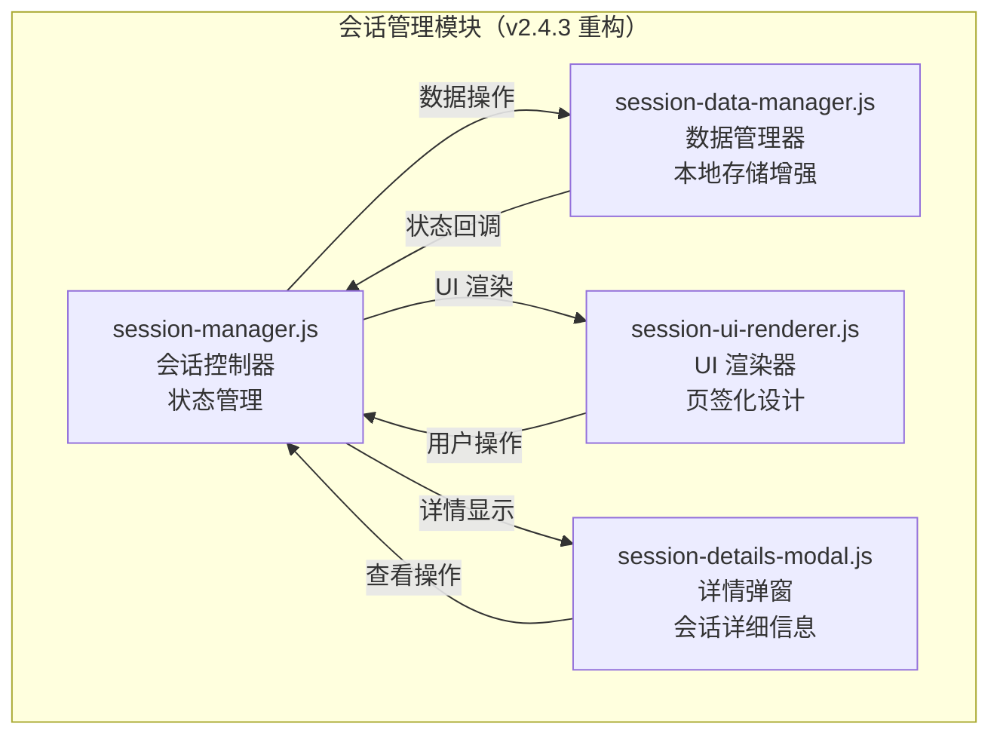

**v2.4.3 重构亮点**：
- **从侧边栏迁移到页签**: 解决浏览器兼容性问题
- **本地历史存储**: 支持 72 小时可配置保存期限
- **隐私控制**: 三级用户消息记录设置（完整/基本/停用）
- **数据管理**: 导出和清理功能
- **UI 重新设计**: 专门的渲染器和详情弹窗

**内核功能**：
- **SessionManager**: 当前会话的状态管理和控制
- **SessionDataManager**: 会话历史记录、统计数据和本地存储管理
- **SessionUIRenderer**: 专门的 UI 渲染器，负责会话列表和状态显示
- **SessionDetailsModal**: 会话详情弹窗，提供完整的会话信息查看

#### 音效通知模块群组 (audio/) - v2.4.3 添加

**模块结构**：
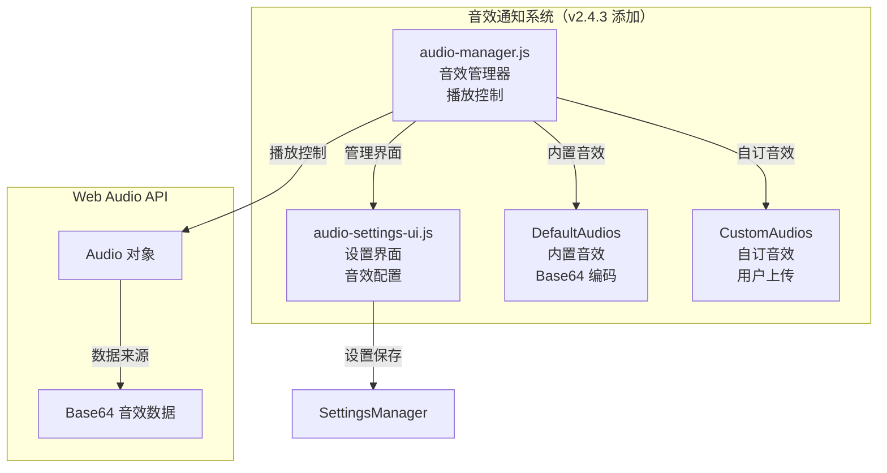

**内核功能**：
- **AudioManager**: 音效播放控制、音量管理、音效选择
- **AudioSettingsUI**: 音效设置界面、上传管理、测试播放
- **内置音效**: 经典提示音、通知铃声、轻柔钟声
- **自订音效**: 支持 MP3、WAV、OGG 格式上传和管理

**技术特性**：
- **Web Audio API**: 使用原生 Audio 对象进行播放
- **Base64 存储**: 音效文档以 Base64 格式存储在 localStorage
- **音量控制**: 0-100% 可调节音量
- **浏览器兼容性**: 处理自动播放政策限制

#### 智能记忆功能 - v2.4.3 添加

**输入框高度管理**：
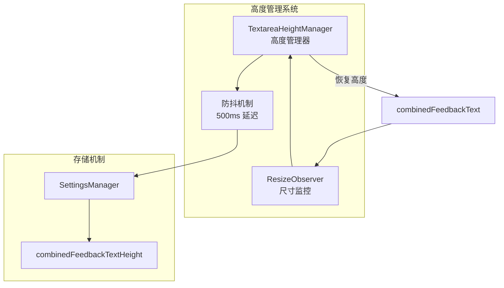

**一键拷贝功能**：
- **项目路径拷贝**: 点击路径文本即可拷贝到剪贴板
- **会话ID拷贝**: 点击会话ID即可拷贝
- **拷贝反馈**: 视觉提示拷贝成功状态
- **国际化支持**: 拷贝提示支持多语言

#### 自动提交功能集成

**集成架构**：
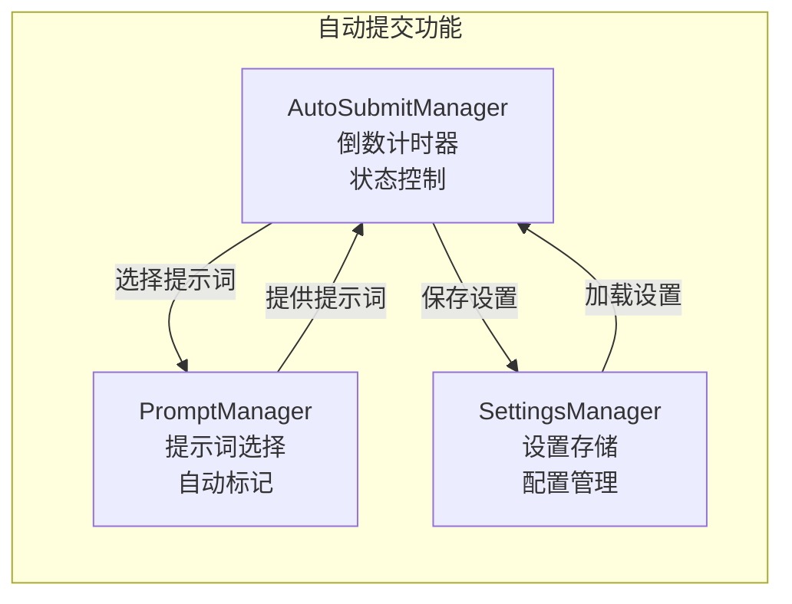

### templates/ - HTML 模板系统

**模板结构**：
```html
<!-- feedback.html - 主回馈页面 -->
<!DOCTYPE html>
<html lang="{{ current_language }}" id="html-root">
<head>
    <meta charset="UTF-8">
    <meta name="viewport" content="width=device-width, initial-scale=1.0">
    <title>{{ title }}</title>
    <link rel="stylesheet" href="/static/css/styles.css">
</head>
<body class="layout-{{ layout_mode }}">
    <div class="container">
        <!-- 页面头部 -->
        <header class="header">
            <div class="header-content">
                <h1 class="title" data-i18n="app.title">MCP Feedback Enhanced</h1>
                <div class="project-info">
                    <span data-i18n="app.projectDirectory">项目目录</span>: {{ project_directory }}
                </div>
            </div>
        </header>

        <!-- 主要内容区域 -->
        <main class="main-content">
            <!-- 标签页导航 -->
            <div class="tab-container">
                <div class="tab-buttons">
                    <button class="tab-button active" data-tab="combined" data-i18n="tabs.combined">📝 工作区</button>
                    <button class="tab-button" data-tab="settings" data-i18n="tabs.settings">⚙️ 设置</button>
                    <button class="tab-button" data-tab="about" data-i18n="tabs.about">ℹ️ 关于</button>
                </div>
            </div>

            <!-- 标签页内容 -->
            <div class="tab-content active" id="combined-tab">
                <!-- AI 摘要区域 -->
                <section class="ai-summary-section">
                    <h2 data-i18n="tabs.summary">📋 AI 摘要</h2>
                    <div id="ai-summary" class="ai-summary-content"></div>
                </section>

                <!-- 回馈表单区域 -->
                <section class="feedback-section">
                    <h2 data-i18n="tabs.feedback">💬 回馈</h2>
                    <form id="feedback-form">
                        <textarea id="feedback-text" placeholder="请输入您的回馈..."></textarea>
                        <div class="form-actions">
                            <button type="submit" data-i18n="buttons.submit">提交回馈</button>
                        </div>
                    </form>
                </section>

                <!-- 图片上传区域 -->
                <section class="image-upload-section">
                    <h2 data-i18n="images.title">🖼️ 图片上传</h2>
                    <div id="image-upload-area" class="upload-area">
                        <input type="file" id="image-input" multiple accept="image/*">
                        <div class="upload-prompt" data-i18n="images.dragDrop">拖拽图片到此处或点击选择</div>
                    </div>
                    <div id="image-preview" class="image-preview"></div>
                </section>

                <!-- 命令运行区域 -->
                <section class="command-section">
                    <h2 data-i18n="tabs.commands">⚡ 命令</h2>
                    <div class="command-input-group">
                        <input type="text" id="command-input" placeholder="输入要运行的命令...">
                        <button id="execute-command" data-i18n="commands.execute">运行</button>
                    </div>
                    <div id="command-output" class="command-output"></div>
                </section>
            </div>
        </main>

        <!-- 状态指示器 -->
        <footer class="footer">
            <div class="status-indicators">
                <div id="connection-status" class="connection-indicator">
                    <span data-i18n="status.connecting">连接中...</span>
                </div>
                <div id="session-status" class="session-indicator">
                    <span data-i18n="status.waiting">等待中...</span>
                </div>
            </div>
        </footer>
    </div>

    <!-- JavaScript 模块加载 -->
    <script src="/static/js/i18n.js"></script>
    <script src="/static/js/modules/utils.js"></script>
    <script src="/static/js/modules/tab-manager.js"></script>
    <script src="/static/js/modules/websocket-manager.js"></script>
    <script src="/static/js/modules/image-handler.js"></script>
    <script src="/static/js/modules/settings-manager.js"></script>
    <script src="/static/js/modules/ui-manager.js"></script>
    <script src="/static/js/modules/auto-refresh-manager.js"></script>
    <script src="/static/js/app.js"></script>
</body>
</html>
```

**模板特性**：
- **Jinja2 模板引擎**: 支持变量替换和条件渲染
- **响应式设计**: 适配桌面和移动设备
- **国际化支持**: `data-i18n` 属性自动翻译
- **模块化加载**: JavaScript 模块按需加载
- **无障碍设计**: 支持键盘导航和屏幕阅读器

### static/js/ - JavaScript 模块系统

**模块化架构**：
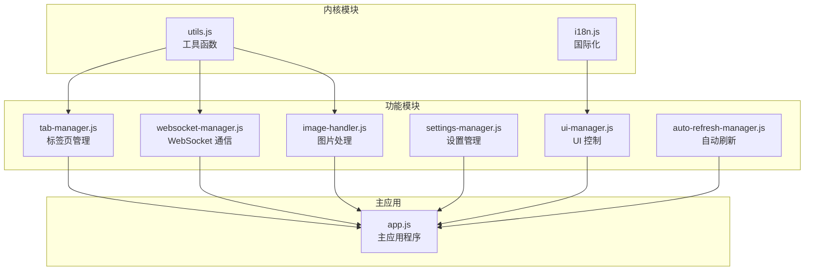

**主要模块说明**：

**app.js - 主应用程序**：
```javascript
class FeedbackApp {
    constructor(sessionId) {
        this.sessionId = sessionId;
        this.currentSessionId = null;

        // 模块管理器
        this.tabManager = null;
        this.webSocketManager = null;
        this.imageHandler = null;
        this.settingsManager = null;
        this.uiManager = null;
        this.autoRefreshManager = null;

        this.isInitialized = false;
    }

    async init() {
        // 等待国际化系统
        await this.waitForI18n();

        // 初始化管理器
        await this.initializeManagers();

        // 设置事件监听器
        await this.setupEventListeners();

        // 设置清理处理器
        await this.setupCleanupHandlers();

        this.isInitialized = true;
    }
}
```

**websocket-manager.js - WebSocket 通信**：
```javascript
class WebSocketManager {
    constructor(app) {
        this.app = app;
        this.websocket = null;
        this.reconnectAttempts = 0;
        this.maxReconnectAttempts = 5;
        this.reconnectDelay = 1000;
    }

    async connect() {
        const protocol = window.location.protocol === 'https:' ? 'wss:' : 'ws:';
        const wsUrl = `${protocol}//${window.location.host}/ws`;

        this.websocket = new WebSocket(wsUrl);
        this.setupEventHandlers();
    }

    async sendMessage(type, data) {
        if (this.websocket?.readyState === WebSocket.OPEN) {
            this.websocket.send(JSON.stringify({ type, data }));
        }
    }
}
```

**image-handler.js - 图片处理**：
```javascript
class ImageHandler {
    constructor(app) {
        this.app = app;
        this.maxFileSize = 1024 * 1024; // 1MB
        this.supportedFormats = ['image/png', 'image/jpeg', 'image/gif', 'image/webp'];
    }

    async handleImageUpload(files) {
        for (const file of files) {
            if (this.validateImage(file)) {
                const compressedImage = await this.compressImage(file);
                await this.uploadImage(compressedImage);
            }
        }
    }

    async compressImage(file) {
        // 图片压缩逻辑
        return new Promise((resolve) => {
            const canvas = document.createElement('canvas');
            const ctx = canvas.getContext('2d');
            const img = new Image();

            img.onload = () => {
                // 压缩处理
                resolve(canvas.toBlob());
            };

            img.src = URL.createObjectURL(file);
        });
    }
}
```

**前端特性总结**：
- **模块化设计**: 清晰的职责分离和依赖管理
- **响应式 UI**: 适配不同屏幕尺寸和设备
- **实时通信**: WebSocket 双向数据同步
- **图片处理**: 自动压缩和格式转换
- **国际化**: 动态语言切换和本地化
- **错误处理**: 优雅的错误恢复机制
- **性能优化**: 延迟加载和资源缓存
- **无障碍支持**: 键盘导航和屏幕阅读器支持

### static/css/ - 样式系统（v2.4.3 扩展）

**样式文档结构**：
```
static/css/
├── styles.css                  # 主样式文档
├── prompt-management.css       # 提示词管理样式
├── session-management.css      # 会话管理样式
└── audio-management.css        # 音效管理样式（v2.4.3 添加）
```

**v2.4.3 添加样式特性**：

**audio-management.css - 音效管理样式**：
```css
/* 音效管理区块样式 */
.audio-management-section {
    background: var(--bg-tertiary);
    border: 1px solid var(--border-color);
    border-radius: 12px;
    padding: 20px;
    margin-bottom: 20px;
    transition: all 0.3s ease;
}

/* 音效设置控制项 */
.audio-setting-item {
    display: flex;
    justify-content: space-between;
    align-items: center;
    margin-bottom: 16px;
    padding: 12px 0;
    border-bottom: 1px solid var(--border-color);
}

/* 音量控制滑杆 */
.audio-volume-slider {
    width: 120px;
    height: 6px;
    background: var(--bg-secondary);
    border-radius: 3px;
    outline: none;
}

/* 自订音效列表 */
.audio-custom-item {
    display: flex;
    justify-content: space-between;
    align-items: center;
    padding: 12px;
    background: var(--bg-primary);
    border: 1px solid var(--border-color);
    border-radius: 8px;
    margin-bottom: 8px;
}
```

**session-management.css - 会话管理样式增强**：
```css
/* v2.4.3 页签化设计 */
.session-tab-content {
    padding: 20px;
    background: var(--bg-primary);
    border-radius: 8px;
    margin-top: 16px;
}

/* 会话卡片样式 */
.session-card {
    background: var(--bg-secondary);
    border: 1px solid var(--border-color);
    border-radius: 8px;
    padding: 16px;
    margin-bottom: 12px;
    transition: all 0.3s ease;
}

.session-card:hover {
    border-color: var(--accent-color);
    box-shadow: 0 2px 8px rgba(0, 122, 204, 0.1);
}

/* 一键拷贝按钮样式 */
.copy-button {
    background: transparent;
    border: none;
    color: var(--accent-color);
    cursor: pointer;
    padding: 2px 6px;
    border-radius: 4px;
    transition: background-color 0.2s ease;
}

.copy-button:hover {
    background: var(--bg-tertiary);
}
```

**响应式设计增强**：
- **移动设备优化**: 音效控制项在小屏幕下垂直排列
- **触摸友好**: 按钮和滑杆适配触摸操作
- **视觉反馈**: 悬停和点击状态的视觉提示
- **深色主题**: 完整的深色主题支持

## 🛠️ 工具层组件

### utils/error_handler.py - 错误处理框架

**统一错误处理**：
```python
class ErrorHandler:
    @staticmethod
    def handle_error(error_type: ErrorType, error: Exception, context: str = "") -> dict:
        """统一错误处理入口"""
        error_info = {
            "type": error_type.value,
            "message": str(error),
            "context": context,
            "timestamp": datetime.now().isoformat(),
            "suggestions": ErrorHandler._get_suggestions(error_type)
        }

        # 记录错误日志
        debug_log(f"错误处理: {error_info}")

        return error_info

class ErrorType(Enum):
    NETWORK_ERROR = "network_error"
    VALIDATION_ERROR = "validation_error"
    TIMEOUT_ERROR = "timeout_error"
    SYSTEM_ERROR = "system_error"
    USER_ERROR = "user_error"
```

### utils/memory_monitor.py - 内存监控

**资源监控**：
```python
class MemoryMonitor:
    def __init__(self):
        self.process = psutil.Process()
        self.baseline_memory = self.get_memory_usage()

    def get_memory_usage(self) -> dict:
        """获取当前内存使用情况"""
        memory_info = self.process.memory_info()
        return {
            "rss": memory_info.rss,  # 实际内存使用
            "vms": memory_info.vms,  # 虚拟内存使用
            "percent": self.process.memory_percent(),
            "available": psutil.virtual_memory().available
        }

    def check_memory_threshold(self, threshold_mb: int = 100) -> bool:
        """检查内存使用是否超过阈值"""
        current_memory = self.get_memory_usage()
        memory_mb = current_memory["rss"] / 1024 / 1024
        return memory_mb > threshold_mb
```

### utils/resource_manager.py - 资源管理

**生命周期管理**：
```python
class ResourceManager:
    def __init__(self):
        self.temp_files: List[Path] = []
        self.active_processes: List[subprocess.Popen] = []
        self.cleanup_callbacks: List[Callable] = []

    def register_temp_file(self, file_path: Path):
        """注册临时文档以便清理"""
        self.temp_files.append(file_path)

    def register_process(self, process: subprocess.Popen):
        """注册进程以便清理"""
        self.active_processes.append(process)

    def cleanup_all(self):
        """清理所有注册的资源"""
        # 清理临时文档
        for file_path in self.temp_files:
            try:
                if file_path.exists():
                    file_path.unlink()
            except Exception as e:
                debug_log(f"清理临时文档失败: {e}")

        # 终止进程
        for process in self.active_processes:
            try:
                process.terminate()
                process.wait(timeout=5)
            except Exception as e:
                debug_log(f"终止进程失败: {e}")
```

### utils/browser.py - 浏览器控制

**智能浏览器打开**：
```python
class BrowserOpener:
    @staticmethod
    def open_browser(url: str) -> bool:
        """智能打开浏览器，支持多种环境"""
        try:
            # 检测运行环境
            environment = detect_environment()

            if environment == "local":
                return BrowserOpener._open_local(url)
            elif environment == "ssh":
                return BrowserOpener._open_ssh(url)
            elif environment == "wsl":
                return BrowserOpener._open_wsl(url)
            else:
                return BrowserOpener._open_fallback(url)

        except Exception as e:
            debug_log(f"打开浏览器失败: {e}")
            return False

    @staticmethod
    def _open_local(url: str) -> bool:
        """本地环境打开浏览器"""
        webbrowser.open(url)
        return True

    @staticmethod
    def _open_ssh(url: str) -> bool:
        """SSH 环境处理"""
        # 提供 SSH 隧道创建指引
        print(f"请在本地终端运行: ssh -L 8765:127.0.0.1:8765 user@host")
        print(f"然后在本地浏览器打开: {url}")
        return True

    @staticmethod
    def _open_wsl(url: str) -> bool:
        """WSL 环境处理"""
        try:
            subprocess.run(["cmd.exe", "/c", "start", url], check=True)
            return True
        except Exception:
            return BrowserOpener._open_fallback(url)
```

### utils/port_manager.py - 端口管理

**动态端口分配**：
```python
class PortManager:
    def __init__(self, start_port: int = 8765, end_port: int = 8865):
        self.start_port = start_port
        self.end_port = end_port
        self.allocated_ports: Set[int] = set()

    def find_available_port(self) -> int:
        """寻找可用端口"""
        for port in range(self.start_port, self.end_port + 1):
            if self.is_port_available(port):
                self.allocated_ports.add(port)
                return port
        raise RuntimeError("无可用端口")

    def is_port_available(self, port: int) -> bool:
        """检查端口是否可用"""
        try:
            with socket.socket(socket.AF_INET, socket.SOCK_STREAM) as sock:
                sock.bind(('127.0.0.1', port))
                return True
        except OSError:
            return False

    def release_port(self, port: int):
        """释放端口"""
        self.allocated_ports.discard(port)
```

### utils/session_cleanup_manager.py - 会话清理

**自动清理机制**：
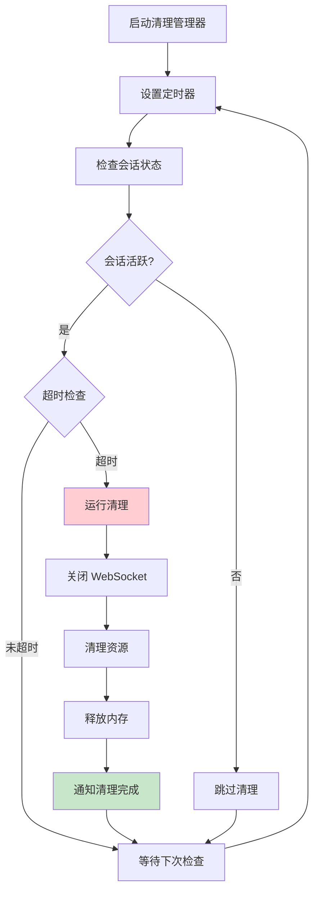

**清理策略**：
- **定时检查**: 每 30 秒检查一次会话状态
- **超时清理**: 会话超时自动触发清理
- **资源回收**: WebSocket 连接、进程、内存
- **优雅关闭**: 确保资源正确释放
- **错误恢复**: 清理失败时的备用方案

### utils/compression_*.py - 压缩工具

**数据压缩优化**：
- **图片压缩**: 自动压缩上传图片至 1MB 以下
- **JSON 压缩**: 大型 JSON 数据的 gzip 压缩
- **传输优化**: WebSocket 消息的选择性压缩
- **缓存机制**: 压缩结果缓存避免重复处理

## 🧪 测试架构

### 测试组织结构

```
tests/
├── unit/                    # 单元测试
│   ├── test_error_handler.py
│   ├── test_memory_monitor.py
│   ├── test_port_manager.py
│   └── test_web_ui.py
├── integration/             # 集成测试
│   ├── test_mcp_workflow.py
│   ├── test_web_integration.py
│   └── test_i18n_integration.py
├── helpers/                 # 测试辅助工具
│   ├── mcp_client.py
│   └── test_utils.py
├── fixtures/                # 测试数据
│   └── test_data.py
└── conftest.py             # pytest 配置
```

### 测试策略

**单元测试**：
- 每个工具模块的独立测试
- 数据模型的验证测试
- 错误处理机制测试
- 国际化功能测试

**集成测试**：
- MCP 工具完整工作流程
- Web UI 与后端交互
- WebSocket 通信测试
- 多语言切换测试

**性能测试**：
- 内存使用监控
- 会话处理性能
- 并发连接测试
- 资源清理效率

## 🔧 开发工具链

### 代码品质工具

**Ruff (Linting + Formatting)**：
- 代码风格检查和自动修复
- 安全漏洞检测
- 导入排序和优化
- 复杂度控制

**mypy (类型检查)**：
- 静态类型检查
- 渐进式类型注解
- 第三方库类型支持
- 错误预防

**pre-commit (提交检查)**：
- 提交前自动检查
- 代码格式化
- 测试运行
- 文档更新

### 依赖管理

**uv (现代 Python 包管理)**：
- 快速依赖解析
- 锁定文档管理
- 开发环境隔离
- 跨平台支持

---

## 📚 相关文档

- **[系统架构总览](./system-overview.md)** - 了解整体架构设计理念
- **[交互流程文档](./interaction-flows.md)** - 详细的用户交互和系统流程
- **[API 参考文档](./api-reference.md)** - 完整的 API 端点和参数说明
- **[部署指南](./deployment-guide.md)** - 环境配置和部署最佳实践

---

**版本**: 2.4.3
**最后更新**: 2025年6月14日
**维护者**: Minidoracat
**架构类型**: Web-Only 四层架构
**v2.4.3 新功能**: 音效通知系统、会话管理重构、智能记忆功能
**技术栈**: Python 3.11+, FastAPI, FastMCP, WebSocket, Web Audio API
