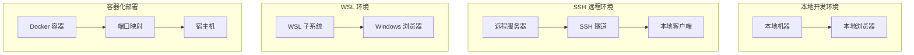
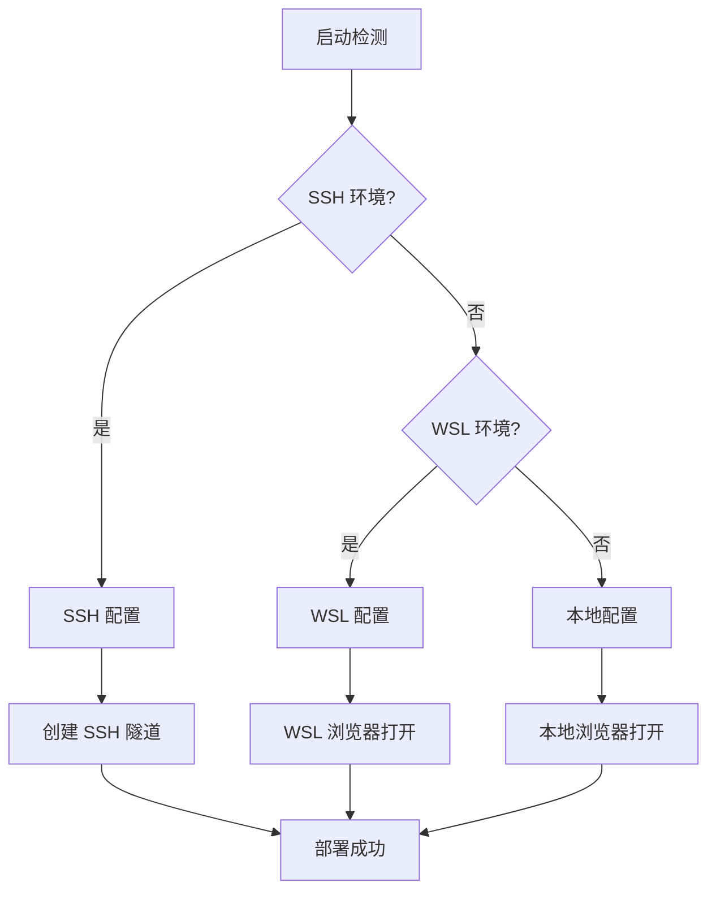

# 部署指南

## 🚀 部署架构概览

MCP Feedback Enhanced 支持多种部署环境，具备智能环境检测和自适应配置能力。

### 部署拓扑图



## 🛠️ 安装和配置

### 系统要求

#### 最低要求
- **Python**: 3.11 或更高版本
- **内存**: 512MB 可用内存
- **磁盘**: 100MB 可用空间
- **网络**: 可访问的网络连接
- **浏览器**: 支持 Web Audio API 的现代浏览器（v2.4.3 音效功能）

#### 推荐配置
- **Python**: 3.12+
- **内存**: 1GB+ 可用内存
- **磁盘**: 500MB+ 可用空间（包含音效文档存储）
- **CPU**: 2 内核或更多
- **浏览器**: Chrome 90+, Firefox 88+, Safari 14+（完整功能支持）

### 安装方式

#### 1. 使用 uvx（推荐）
```bash
# 直接运行
uvx mcp-feedback-enhanced@latest web

# 指定版本
uvx mcp-feedback-enhanced@2.4.3 web
```

#### 2. 使用 pip
```bash
# 安装
pip install mcp-feedback-enhanced

# 运行
mcp-feedback-enhanced web
```

#### 3. 从源码安装
```bash
# 克隆仓库
git clone https://github.com/hefy2027/feedback-angel.git
cd mcp-feedback-enhanced

# 使用 uv 安装
uv sync

# 运行
uv run python -m mcp_feedback_enhanced web
```

## 🌍 环境配置

### 环境检测机制



### 1. 本地环境部署

**特点**:
- 直接在本地机器运行
- 自动打开本地浏览器
- 最简单的部署方式

**配置**:
```bash
# 运行命令
mcp-feedback-enhanced web

# 自动检测并打开浏览器
# 默认地址: http://localhost:8000
```

### 2. SSH 远程环境部署

**特点**:
- 在远程服务器运行服务
- 自动创建 SSH 隧道
- 本地浏览器访问远程服务

**配置步骤**:

1. **在远程服务器安装**:
```bash
# SSH 连接到远程服务器
ssh user@remote-server

# 安装服务
pip install mcp-feedback-enhanced
```

2. **运行服务**:
```bash
# 在远程服务器运行
mcp-feedback-enhanced web --host 0.0.0.0 --port 8000
```

3. **创建 SSH 隧道**（自动或手动）:
```bash
# 手动创建隧道（如果自动检测失败）
ssh -L 8000:localhost:8000 user@remote-server
```

### 3. WSL 环境部署

**特点**:
- 在 WSL 子系统中运行
- 自动打开 Windows 浏览器
- 跨系统无缝集成

**配置**:
```bash
# 在 WSL 中运行
mcp-feedback-enhanced web

# 自动检测 WSL 环境并打开 Windows 浏览器
```

### 4. 容器化部署

#### Docker 部署
```dockerfile
# Dockerfile
FROM python:3.12-slim

WORKDIR /app
COPY . .

RUN pip install mcp-feedback-enhanced

EXPOSE 8000

CMD ["mcp-feedback-enhanced", "web", "--host", "0.0.0.0", "--port", "8000"]
```

```bash
# 构建和运行
docker build -t mcp-feedback-enhanced .
docker run -p 8000:8000 mcp-feedback-enhanced
```

#### Docker Compose
```yaml
# docker-compose.yml
version: '3.8'

services:
  mcp-feedback:
    build: .
    ports:
      - "8000:8000"
    environment:
      - ENVIRONMENT=docker
    volumes:
      - ./projects:/app/projects
    restart: unless-stopped
```

## ⚙️ 配置选项

### 命令行参数

```bash
mcp-feedback-enhanced web [OPTIONS]
```

| 参数 | 类型 | 默认值 | 描述 |
|------|------|--------|------|
| `--host` | `str` | `localhost` | 绑定的主机地址 |
| `--port` | `int` | `8000` | 服务端口号 |
| `--debug` | `bool` | `False` | 激活调试模式 |
| `--no-browser` | `bool` | `False` | 不自动打开浏览器 |
| `--timeout` | `int` | `600` | 缺省会话超时时间（秒） |
| `--audio-enabled` | `bool` | `True` | 激活音效通知（v2.4.3 添加） |
| `--session-retention` | `int` | `72` | 会话历史保存时间（小时，v2.4.3 添加） |

### 环境变量

```bash
# 设置环境变量
export MCP_FEEDBACK_HOST=0.0.0.0
export MCP_FEEDBACK_PORT=9000
export MCP_FEEDBACK_DEBUG=true
export MCP_FEEDBACK_TIMEOUT=1200
export MCP_FEEDBACK_AUDIO_ENABLED=true
export MCP_FEEDBACK_SESSION_RETENTION=72
```

### 配置文档
```json
// config.json
{
    "server": {
        "host": "localhost",
        "port": 8000,
        "debug": false
    },
    "session": {
        "timeout": 600,
        "max_connections": 5
    },
    "ui": {
        "default_language": "zh-TW",
        "theme": "light"
    },
    "audio": {
        "enabled": true,
        "default_volume": 75,
        "max_custom_audios": 20,
        "max_file_size_mb": 2
    },
    "session_history": {
        "retention_hours": 72,
        "max_retention_hours": 168,
        "privacy_level": "full",
        "auto_cleanup": true
    }
}
```

## 🆕 v2.4.3 版本部署考虑

### 音效通知系统部署

#### 浏览器兼容性检查
```javascript
// 检查 Web Audio API 支持
function checkAudioSupport() {
    if (typeof Audio === 'undefined') {
        console.warn('Web Audio API 不支持，音效功能将被停用');
        return false;
    }
    return true;
}
```

#### 音效文档存储配置
```json
{
    "audio_storage": {
        "type": "localStorage",
        "max_size_mb": 10,
        "compression": true,
        "fallback_enabled": true
    }
}
```

#### 自动播放政策处理
```bash
# 部署时需要考虑浏览器自动播放限制
# Chrome: 需要用户交互后才能播放音效
# Firefox: 缺省允许音效播放
# Safari: 需要用户手势触发
```

### 会话管理重构部署

#### localStorage 容量规划
```javascript
// 估算存储需求
const estimatedStorage = {
    sessions_per_day: 50,
    average_session_size_kb: 5,
    retention_days: 3,
    total_size_mb: (50 * 5 * 3) / 1024  // 约 0.73 MB
};
```

#### 隐私设置配置
```json
{
    "privacy_defaults": {
        "user_message_recording": "full",
        "retention_hours": 72,
        "auto_cleanup": true,
        "export_enabled": true
    }
}
```

### 智能记忆功能部署

#### ResizeObserver 支持检查
```javascript
// 检查 ResizeObserver 支持
if (typeof ResizeObserver === 'undefined') {
    console.warn('ResizeObserver 不支持，高度记忆功能将使用 fallback');
    // 使用 window.resize 事件作为 fallback
}
```

#### 设置存储优化
```json
{
    "memory_settings": {
        "debounce_delay_ms": 500,
        "max_stored_heights": 10,
        "cleanup_interval_hours": 24
    }
}
```

## 🔧 运维管理

### 服务监控

#### 健康检查端点
```bash
# 检查服务状态
curl http://localhost:8000/health

# 响应示例
{
    "status": "healthy",
    "version": "2.4.3",
    "uptime": "2h 30m 15s",
    "active_sessions": 1,
    "features": {
        "audio_notifications": true,
        "session_history": true,
        "smart_memory": true
    },
    "storage": {
        "session_history_count": 25,
        "custom_audio_count": 3,
        "localStorage_usage_mb": 1.2
    }
}
```

#### 日志监控
```python
# 日志配置
import logging

logging.basicConfig(
    level=logging.INFO,
    format='%(asctime)s - %(name)s - %(levelname)s - %(message)s',
    handlers=[
        logging.FileHandler('mcp-feedback.log'),
        logging.StreamHandler()
    ]
)
```

### 性能调优

#### 内存优化
```python
# 会话清理配置
SESSION_CLEANUP_INTERVAL = 300  # 5分钟
SESSION_TIMEOUT = 600  # 10分钟
MAX_CONCURRENT_SESSIONS = 10
```

#### 网络优化
```python
# WebSocket 配置
WEBSOCKET_PING_INTERVAL = 30
WEBSOCKET_PING_TIMEOUT = 10
MAX_WEBSOCKET_CONNECTIONS = 50
```

### 故障排除

#### 常见问题

**v2.4.3 添加问题**：

1. **音效无法播放**
```bash
# 检查浏览器自动播放政策
# 解决方案：用户需要先与页面交互
console.log('请点击页面任意位置以激活音效功能');

# 检查音效文档格式
# 支持格式：MP3, WAV, OGG
# 最大文档大小：2MB
```

2. **会话历史丢失**
```bash
# 检查 localStorage 容量
# 解决方案：清理过期数据或增加保存期限
localStorage.getItem('sessionHistory');

# 检查隐私设置
# 确认用户消息记录等级设置正确
```

3. **输入框高度不记忆**
```bash
# 检查 ResizeObserver 支持
if (typeof ResizeObserver === 'undefined') {
    console.warn('浏览器不支持 ResizeObserver');
}

# 检查设置存储
localStorage.getItem('combinedFeedbackTextHeight');
```

4. **端口被占用**
```bash
# 检查端口使用情况
netstat -tulpn | grep 8000

# 解决方案：使用不同端口
mcp-feedback-enhanced web --port 8001
```

2. **浏览器无法打开**
```bash
# 手动打开浏览器
mcp-feedback-enhanced web --no-browser
# 然后手动访问 http://localhost:8000
```

3. **SSH 隧道失败**
```bash
# 手动创建隧道
ssh -L 8000:localhost:8000 user@remote-server

# 或使用不同端口
ssh -L 8001:localhost:8000 user@remote-server
```

#### 调试模式
```bash
# 激活详细日志
mcp-feedback-enhanced web --debug

# 查看详细错误信息
export PYTHONPATH=.
python -m mcp_feedback_enhanced.debug
```

### 安全配置

#### 生产环境安全
```python
# 限制 CORS
app.add_middleware(
    CORSMiddleware,
    allow_origins=["https://yourdomain.com"],
    allow_credentials=True,
    allow_methods=["GET", "POST"],
    allow_headers=["*"],
)

# 添加安全标头
@app.middleware("http")
async def add_security_headers(request, call_next):
    response = await call_next(request)
    response.headers["X-Content-Type-Options"] = "nosniff"
    response.headers["X-Frame-Options"] = "DENY"
    response.headers["X-XSS-Protection"] = "1; mode=block"
    return response
```

#### 防火墙配置
```bash
# Ubuntu/Debian
sudo ufw allow 8000/tcp

# CentOS/RHEL
sudo firewall-cmd --permanent --add-port=8000/tcp
sudo firewall-cmd --reload
```

## 📊 监控和指针

### 系统指针
- CPU 使用率
- 内存使用量
- 网络连接数
- 活跃会话数

### 业务指针
- 会话创建率
- 回馈提交率
- 平均回应时间
- 错误率

### v2.4.3 添加指针
- 音效播放成功率
- 会话历史存储使用量
- 自订音效上传数量
- 输入框高度调整频率
- localStorage 使用量

### 监控工具集成
```python
# Prometheus 指针
from prometheus_client import Counter, Histogram, Gauge

session_counter = Counter('mcp_sessions_total', 'Total sessions created')
response_time = Histogram('mcp_response_time_seconds', 'Response time')
active_sessions = Gauge('mcp_active_sessions', 'Active sessions')

# v2.4.3 添加指针
audio_plays = Counter('mcp_audio_plays_total', 'Total audio notifications played')
audio_errors = Counter('mcp_audio_errors_total', 'Total audio playback errors')
session_history_size = Gauge('mcp_session_history_size_bytes', 'Session history storage size')
custom_audio_count = Gauge('mcp_custom_audio_count', 'Number of custom audio files')
height_adjustments = Counter('mcp_height_adjustments_total', 'Total textarea height adjustments')
```

---

## 🔄 版本升级指南

### 从 v2.4.2 升级到 v2.4.3

#### 1. 备份现有数据
```bash
# 备份用户设置
cp ~/.mcp-feedback/settings.json ~/.mcp-feedback/settings.json.backup

# 备份提示词数据
cp ~/.mcp-feedback/prompts.json ~/.mcp-feedback/prompts.json.backup
```

#### 2. 升级软件
```bash
# 使用 uvx 升级
uvx mcp-feedback-enhanced@2.4.3 web

# 或使用 pip 升级
pip install --upgrade mcp-feedback-enhanced==2.4.3
```

#### 3. 验证新功能
```bash
# 检查音效功能
curl http://localhost:8000/health | jq '.features.audio_notifications'

# 检查会话历史功能
curl http://localhost:8000/health | jq '.features.session_history'

# 检查智能记忆功能
curl http://localhost:8000/health | jq '.features.smart_memory'
```

#### 4. 配置迁移
```json
// 添加的配置项目会自动使用默认值
{
    "audio": {
        "enabled": true,
        "volume": 75,
        "selectedAudioId": "default-beep"
    },
    "sessionHistory": {
        "retentionHours": 72,
        "privacyLevel": "full"
    },
    "smartMemory": {
        "heightMemoryEnabled": true
    }
}
```

### 回滚指南

如果需要回滚到 v2.4.2：

```bash
# 停止服务
pkill -f mcp-feedback-enhanced

# 安装旧版本
pip install mcp-feedback-enhanced==2.4.2

# 恢复备份设置
cp ~/.mcp-feedback/settings.json.backup ~/.mcp-feedback/settings.json

# 重新启动服务
mcp-feedback-enhanced web
```

---

**版本**: 2.4.3
**最后更新**: 2025年6月14日
**维护者**: Minidoracat
**新功能**: 音效通知系统、会话管理重构、智能记忆功能、一键拷贝
**完成**: 架构文档体系已更新完成，包含 v2.4.3 版本的完整技术文档和部署指南。
