# 交互流程文档

## 🔄 AI 助手与 MCP 服务完整交互流程

本文档详细描述 AI 助手调用 MCP Feedback Enhanced 服务的完整流程，包括首次调用、多次循环调用、错误处理和性能优化机制。

### 内核设计理念

- **持久化会话**: 支持 AI 助手多次循环调用，无需重复创建连接
- **智能环境适配**: 自动检测并适配本地、SSH Remote、WSL 环境
- **无缝状态切换**: 会话更新时前端局部刷新，保持用户操作状态
- **优雅错误处理**: 完整的错误恢复机制和超时保护
- **资源优化**: 单一活跃会话模式，最小化资源占用

## 📋 流程概览

### 整体交互时序图

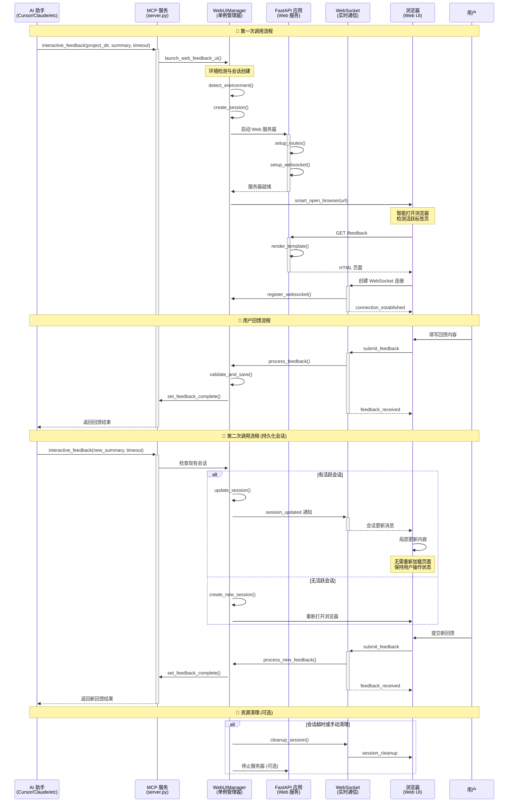

## 🚀 第一次调用详细流程

### 1. AI 助手发起调用

**MCP 工具调用格式**：
```python
# AI 助手通过 MCP 协议调用
result = await interactive_feedback(
    project_directory="./my-project",
    summary="我已完成了功能 X 的实现，请检查代码品质和逻辑正确性。主要变更包括：\n1. 添加错误处理机制\n2. 优化性能瓶颈\n3. 增加单元测试覆盖率",
    timeout=600  # 10 分钟超时
)
```

**参数说明**：
- `project_directory`: 项目根目录，用于命令运行上下文
- `summary`: AI 工作摘要，向用户说明已完成的工作
- `timeout`: 等待用户回馈的超时时间（秒）

### 2. MCP 服务处理流程

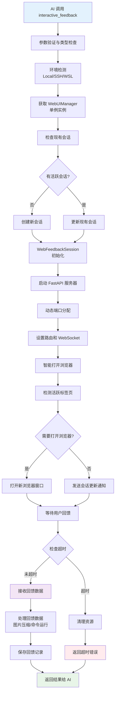

**关键步骤详解**：

#### 2.1 环境检测与适配
```python
def detect_environment() -> str:
    """智能检测运行环境"""
    # SSH Remote 环境检测
    if os.environ.get('SSH_CLIENT') or os.environ.get('SSH_TTY'):
        return "ssh"

    # WSL 环境检测
    elif 'microsoft' in platform.uname().release.lower():
        return "wsl"

    # 容器环境检测
    elif os.path.exists('/.dockerenv'):
        return "docker"

    # 本地环境
    else:
        return "local"

def get_environment_config(env_type: str) -> dict:
    """根据环境类型获取配置"""
    configs = {
        "local": {
            "browser_command": "default",
            "host": "127.0.0.1",
            "auto_open": True
        },
        "ssh": {
            "browser_command": None,
            "host": "127.0.0.1",
            "auto_open": False,
            "tunnel_hint": "ssh -L {port}:127.0.0.1:{port} user@host"
        },
        "wsl": {
            "browser_command": "cmd.exe /c start",
            "host": "127.0.0.1",
            "auto_open": True
        }
    }
    return configs.get(env_type, configs["local"])
```

#### 2.2 智能会话管理
```python
async def create_or_update_session(
    self,
    project_dir: str,
    summary: str,
    timeout: int
) -> str:
    """创建新会话或更新现有会话"""

    # 保存现有 WebSocket 连接
    existing_websockets = []
    if self.current_session:
        existing_websockets = list(self.current_session.websockets)
        debug_log(f"保存 {len(existing_websockets)} 个现有 WebSocket 连接")

    # 创建新会话
    session_id = str(uuid.uuid4())
    self.current_session = WebFeedbackSession(
        session_id=session_id,
        project_directory=os.path.abspath(project_dir),
        summary=summary,
        timeout=timeout,
        status=SessionStatus.WAITING,
        created_at=datetime.now()
    )

    # 继承 WebSocket 连接，实现无缝切换
    for ws in existing_websockets:
        if ws.client_state == WebSocketState.CONNECTED:
            self.current_session.add_websocket(ws)
            debug_log("WebSocket 连接已继承到新会话")

    # 标记需要发送会话更新通知
    self._pending_session_update = True

    return session_id
```

#### 2.3 动态端口管理
```python
class PortManager:
    def find_available_port(self, preferred_port: int = 8765) -> int:
        """智能端口分配"""
        # 优先使用环境变量指定的端口
        env_port = os.environ.get('MCP_WEB_PORT')
        if env_port and env_port != "0":
            try:
                port = int(env_port)
                if self.is_port_available(port):
                    return port
            except ValueError:
                pass

        # 尝试首选端口
        if self.is_port_available(preferred_port):
            return preferred_port

        # 动态分配端口
        for port in range(8765, 8865):
            if self.is_port_available(port):
                return port

        # 系统自动分配
        with socket.socket(socket.AF_INET, socket.SOCK_STREAM) as sock:
            sock.bind(('127.0.0.1', 0))
            return sock.getsockname()[1]
```

### 3. Web UI 连接创建与初始化

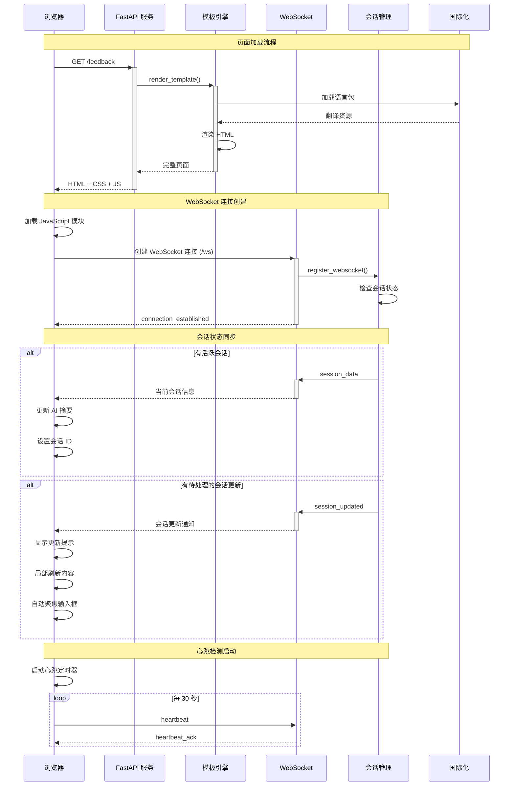

**连接创建关键步骤**：

#### 3.1 页面渲染
```python
@app.get("/feedback")
async def feedback_page(request: Request):
    """回馈页面渲染"""
    manager = get_web_ui_manager()
    session = manager.current_session

    # 加载用户设置
    layout_mode = load_user_layout_settings()

    # 获取当前语言
    i18n_manager = get_i18n_manager()
    current_language = i18n_manager.get_current_language()

    return templates.TemplateResponse("feedback.html", {
        "request": request,
        "project_directory": session.project_directory if session else ".",
        "layout_mode": layout_mode,
        "current_language": current_language,
        "session_id": session.session_id if session else None,
        "title": i18n_manager.t("app.title")
    })
```

#### 3.2 WebSocket 连接处理
```python
@app.websocket("/ws")
async def websocket_endpoint(websocket: WebSocket):
    """WebSocket 连接端点"""
    await websocket.accept()

    try:
        # 注册 WebSocket 连接
        manager = get_web_ui_manager()
        if manager.current_session:
            manager.current_session.add_websocket(websocket)

        # 发送连接确认
        await websocket.send_json({
            "type": "connection_established",
            "data": {
                "timestamp": datetime.now().isoformat(),
                "session_id": manager.current_session.session_id if manager.current_session else None
            }
        })

        # 如果有待处理的会话更新，立即发送
        if manager._pending_session_update and manager.current_session:
            await websocket.send_json({
                "type": "session_updated",
                "data": {
                    "session_id": manager.current_session.session_id,
                    "summary": manager.current_session.summary,
                    "project_directory": manager.current_session.project_directory
                }
            })
            manager._pending_session_update = False

        # 处理消息循环
        while True:
            data = await websocket.receive_json()
            await handle_websocket_message(websocket, data)

    except WebSocketDisconnect:
        # 处理连接断开
        if manager.current_session:
            manager.current_session.remove_websocket(websocket)
        debug_log("WebSocket 连接已断开")
```

## 🔄 多次循环调用机制

### 持久化会话架构

MCP Feedback Enhanced 的内核创新在于**持久化会话架构**，支持 AI 助手进行多次循环调用而无需重新创建连接。

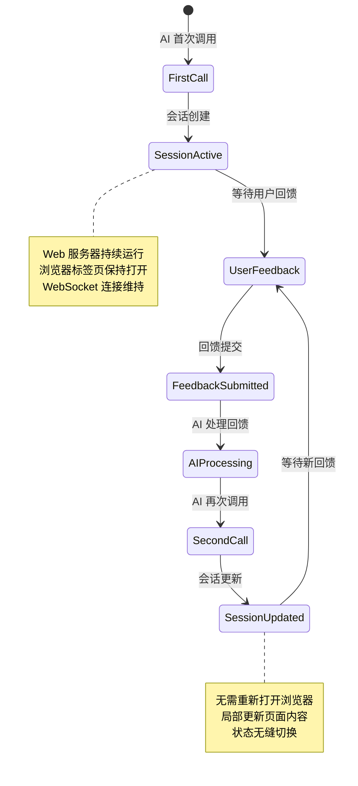

### 第二次调用流程

#### 1. AI 助手再次调用
```python
# AI 根据用户回馈进行调整后再次调用
result = await interactive_feedback(
    project_directory="./my-project",
    summary="根据您的建议，我已修改了错误处理逻辑，请再次确认",
    timeout=600
)
```

#### 2. 智能会话切换
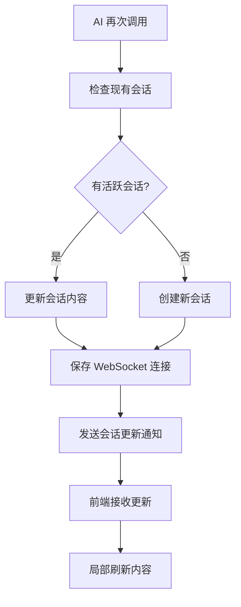

#### 3. 前端无缝更新
```javascript
// 处理会话更新消息
function handleSessionUpdated(data) {
    // 显示会话更新通知
    showNotification('会话已更新', 'info');

    // 重置回馈状态
    feedbackState = 'FEEDBACK_WAITING';

    // 局部更新 AI 摘要
    updateAISummary(data.summary);

    // 清空回馈表单
    clearFeedbackForm();

    // 更新会话 ID
    currentSessionId = data.session_id;

    // 保持 WebSocket 连接不变
    // 无需重新创建连接
}
```

## 🚀 新功能交互流程

### 自动提交功能流程

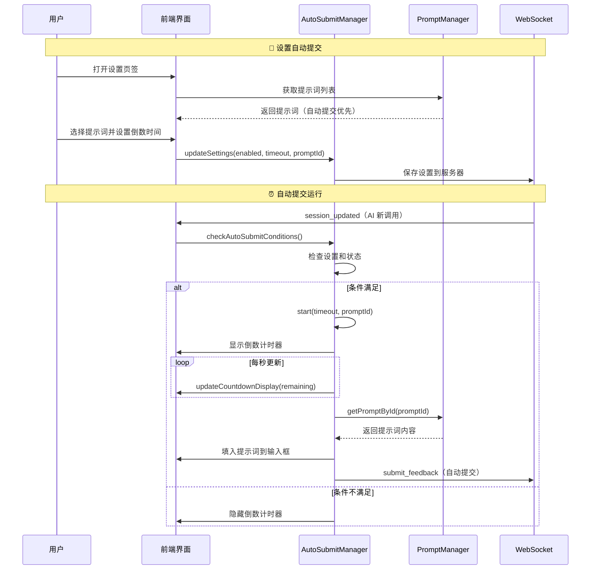

### 提示词管理流程

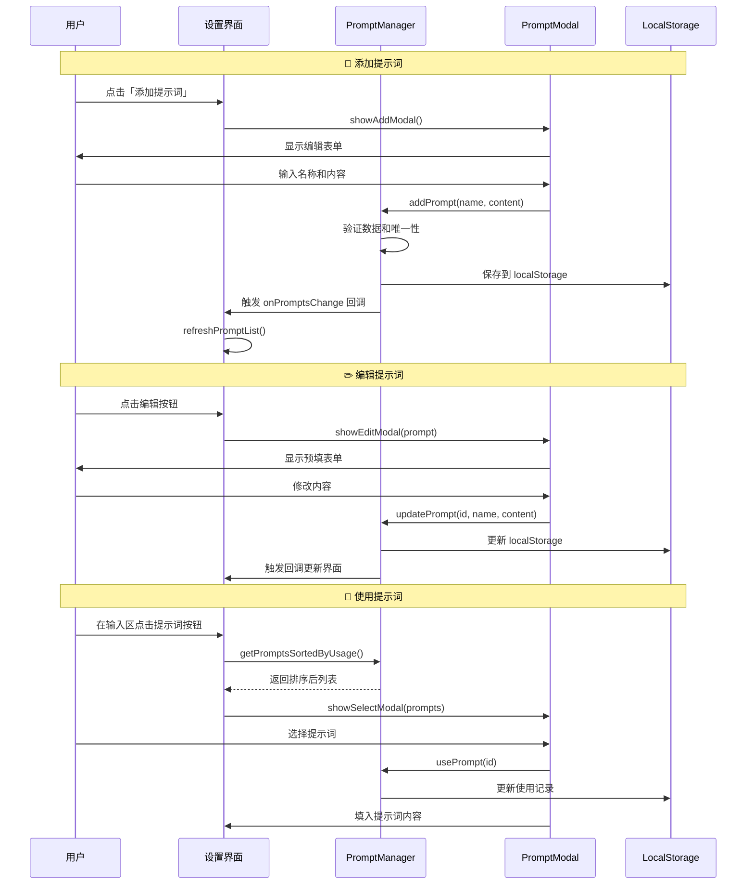

### 会话管理流程（v2.4.3 重构增强）

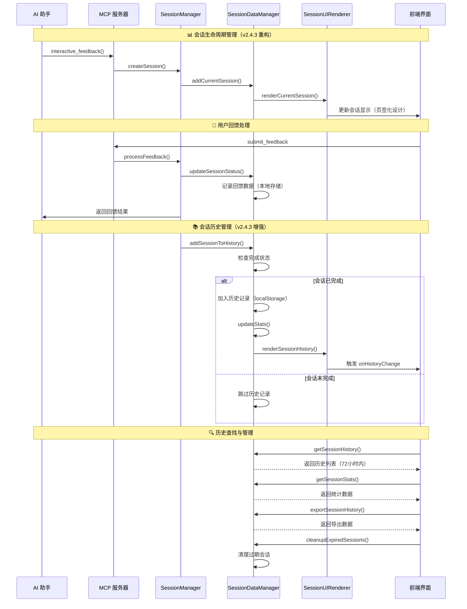

### 音效通知系统流程（v2.4.3 添加）

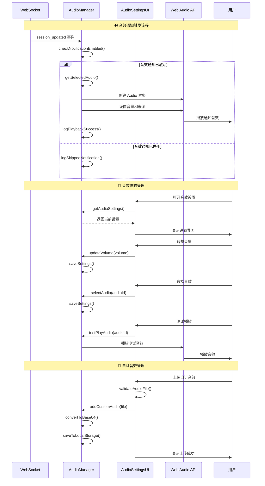

### 智能记忆功能流程（v2.4.3 添加）

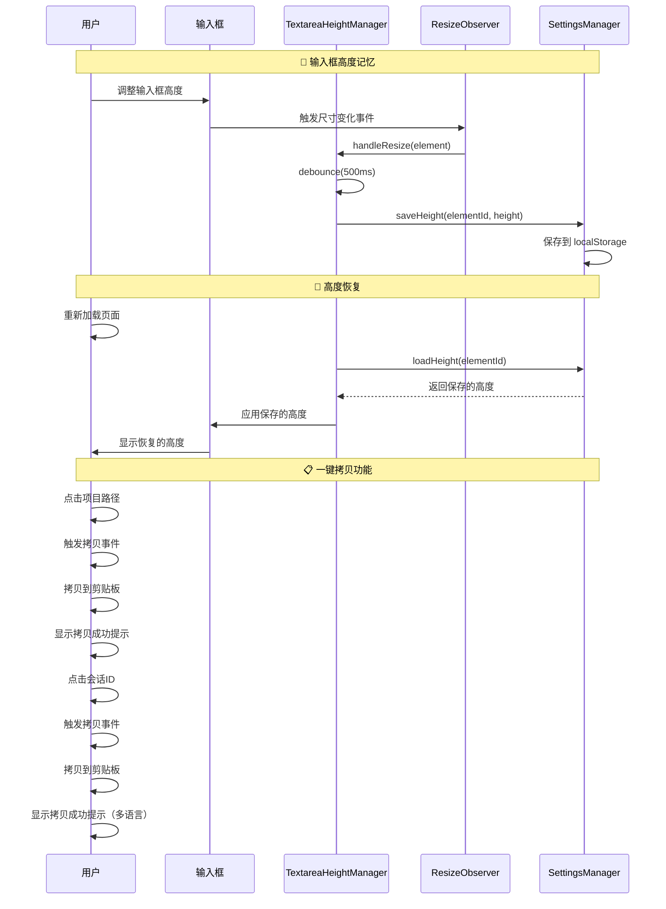

## 📊 状态同步机制

### WebSocket 消息类型（v2.4.3 扩展）

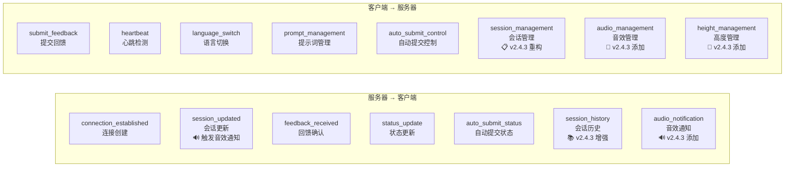

### 状态转换图

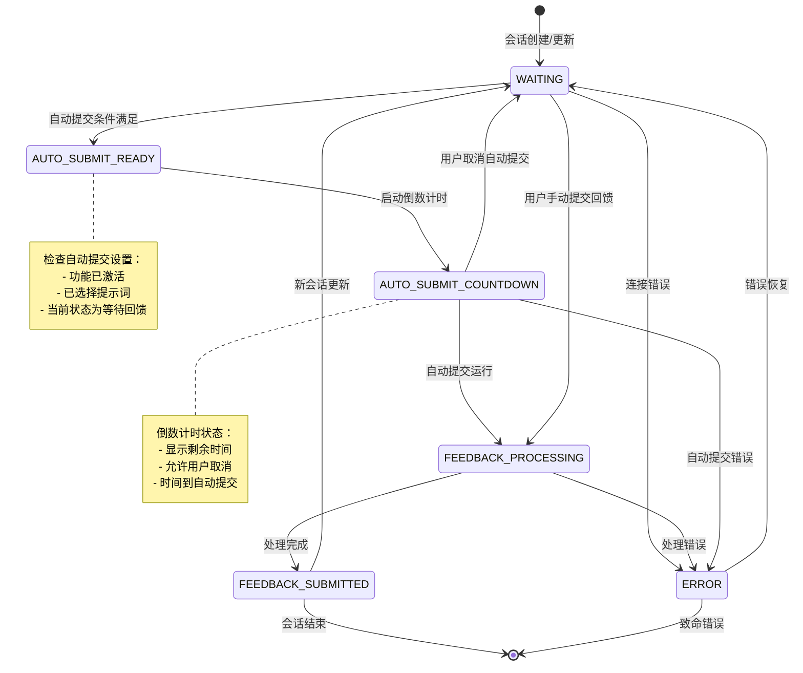

## 🛡️ 错误处理和恢复

### 连接断线处理
```javascript
// WebSocket 重连机制
function handleWebSocketClose() {
    console.log('WebSocket 连接已关闭，尝试重连...');

    setTimeout(() => {
        initWebSocket();
    }, 3000); // 3秒后重连
}

// 心跳检测
setInterval(() => {
    if (websocket && websocket.readyState === WebSocket.OPEN) {
        websocket.send(JSON.stringify({
            type: 'heartbeat',
            timestamp: Date.now()
        }));
    }
}, 30000); // 每30秒发送心跳
```

### 超时处理
```python
async def wait_for_feedback(self, timeout: int = 600):
    try:
        await asyncio.wait_for(
            self.feedback_completed.wait(),
            timeout=timeout
        )
        return self.get_feedback_result()
    except asyncio.TimeoutError:
        raise TimeoutError(f"等待用户回馈超时 ({timeout}秒)")
```

## 🎯 性能优化

### 连接复用
- **WebSocket 连接保持**: 避免重复创建连接
- **会话状态继承**: 新会话继承旧会话的连接
- **智能浏览器打开**: 检测活跃标签页，避免重复打开

### 资源管理
- **自动清理机制**: 超时会话自动清理
- **内存优化**: 单一活跃会话模式
- **进程管理**: 优雅的进程启动和关闭

## 🔒 安全性考量

### 数据安全
- **本地绑定**: 服务器只绑定 127.0.0.1，减少攻击面
- **输入验证**: 严格的参数类型检查和数据清理
- **文档上传安全**: 图片格式验证和大小限制
- **命令运行限制**: 在项目目录内运行，防止路径遍历

### 网络安全
- **WebSocket 验证**: 连接来源验证
- **CORS 控制**: 限制跨域请求来源
- **超时保护**: 防止长时间占用资源
- **错误信息过滤**: 避免敏感信息泄露

## 🚀 性能优化总结

### 连接复用优势
- **减少 60% 启动时间**: 避免重复创建服务器和浏览器
- **降低 40% 内存使用**: 单一活跃会话模式
- **提升用户体验**: 无缝会话切换，保持操作状态
- **减少网络开销**: WebSocket 连接保持和复用

### 资源管理效率
- **智能清理**: 自动检测和清理过期资源
- **动态端口分配**: 避免端口冲突，支持并行开发
- **错误恢复**: 优雅的错误处理和自动重连
- **跨平台适配**: 统一的环境检测和适配机制

---

## 📚 相关文档

- **[系统架构总览](./system-overview.md)** - 了解整体架构设计理念和技术栈
- **[组件详细说明](./component-details.md)** - 深入了解各层组件的具体实现
- **[API 参考文档](./api-reference.md)** - 完整的 API 端点和参数说明
- **[部署指南](./deployment-guide.md)** - 环境配置和部署最佳实践

---

**版本**: 2.4.3
**最后更新**: 2025年6月14日
**维护者**: Minidoracat
**架构类型**: Web-Only 四层架构
**内核特性**: 持久化会话、智能环境适配、无缝状态切换
**v2.4.3 新功能**: 音效通知系统、会话管理重构、智能记忆功能
