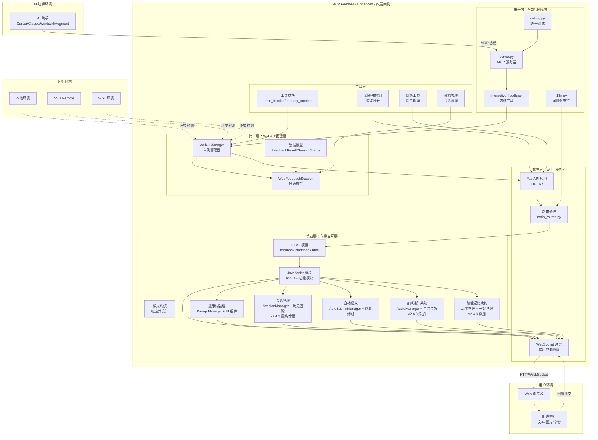
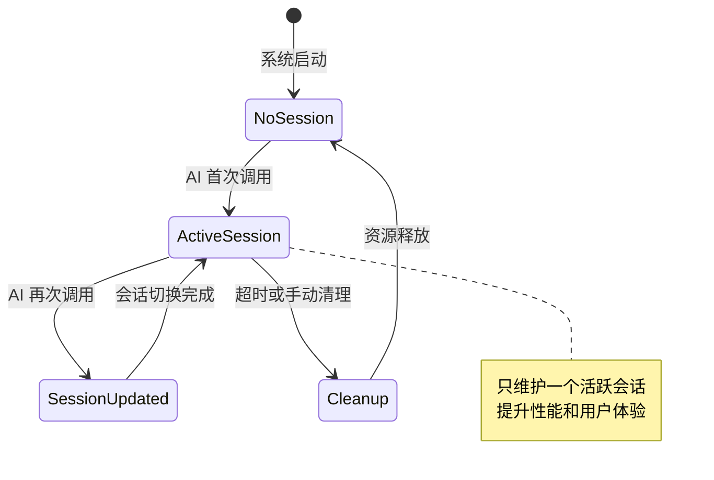
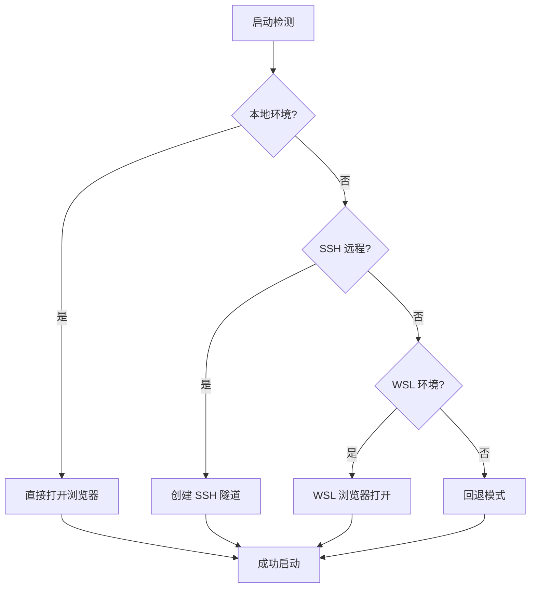
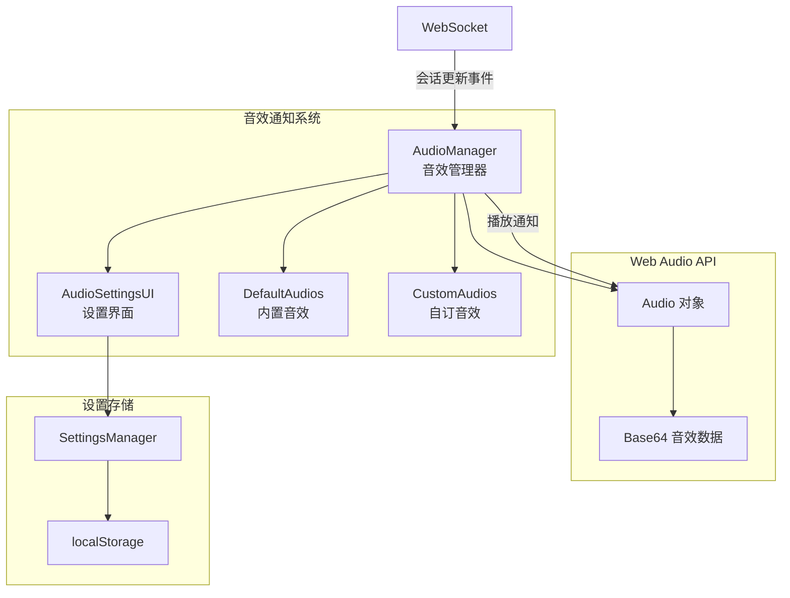
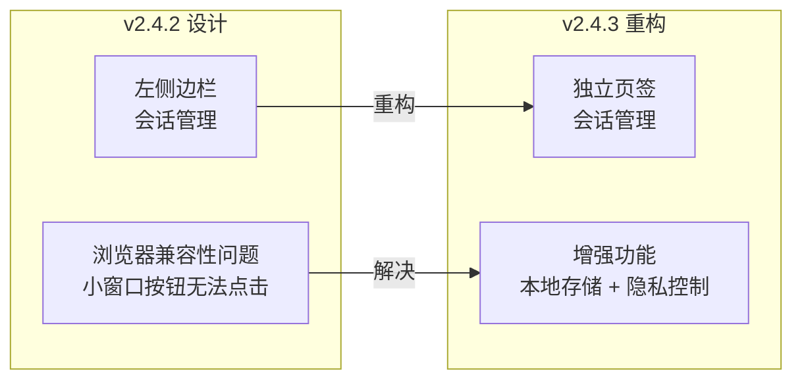
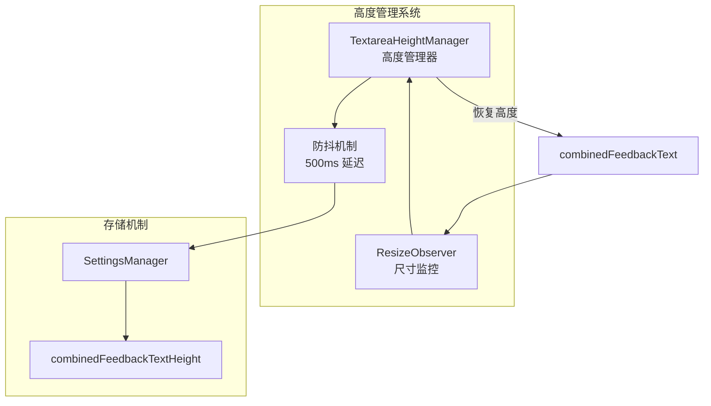
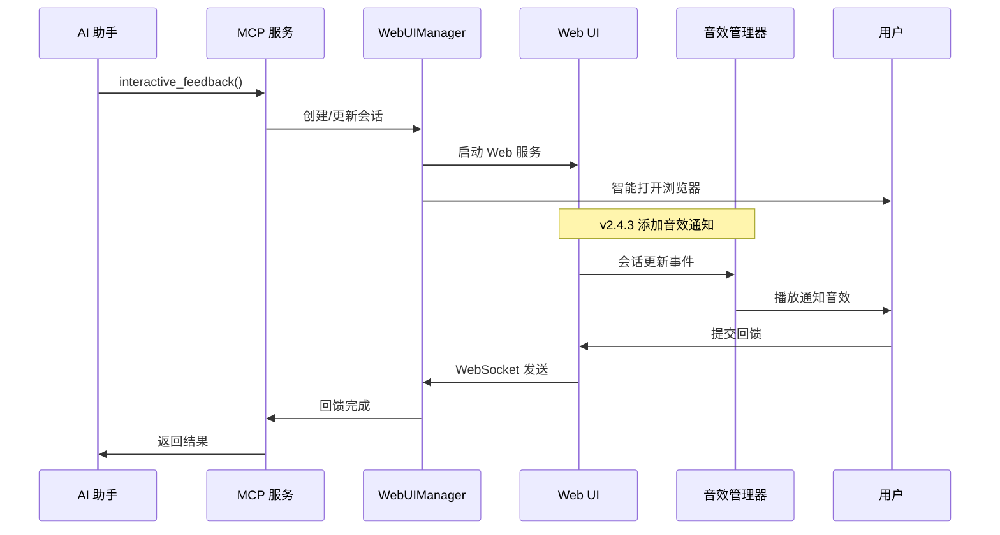
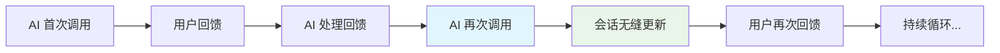

# 系统架构总览

## 🏗️ 整体架构设计

MCP Feedback Enhanced 采用**单一活跃会话 + 持久化 Web UI**的创新架构设计，实现 AI 助手与用户之间的高效、无缝交互体验。

### 内核设计理念

- **Web-Only 架构**：完全基于 Web 技术，已移除所有 Electron 桌面应用功能
- **四层架构设计**：清晰的层次分离，便于维护和扩展
- **智能环境检测**：自动识别本地、SSH Remote、WSL 环境并优化配置
- **单一活跃会话**：替代传统多会话管理，提升性能和用户体验
- **模块化设计**：每层职责明确，支持独立开发和测试

### 技术栈概览

**后端技术**：
- Python 3.11+ (内核语言)
- FastMCP 2.0+ (MCP 协议实现)
- FastAPI 0.115+ (Web 框架)
- uvicorn 0.30+ (ASGI 服务器)
- WebSocket (实时通信)

**前端技术**：
- HTML5 + CSS3 (现代化 UI)
- JavaScript ES6+ (模块化架构)
- WebSocket API (双向通信)
- Web Audio API (音效通知系统)
- localStorage API (本地数据存储)
- ResizeObserver API (元素尺寸监控)
- 响应式设计 (多设备支持)

**开发工具**：
- pytest + pytest-asyncio (测试框架)
- Ruff + mypy (代码品质)
- pre-commit (提交检查)
- uv (依赖管理)

### 系统整体架构图



## 🎯 内核设计理念

### 1. Web-Only 架构优势

**完全移除桌面应用依赖**：
- 无需安装 Electron 或其他桌面应用框架
- 减少系统资源占用和安全风险
- 支持所有具备现代浏览器的环境
- 简化部署和维护流程

**跨平台统一体验**：
- Windows、macOS、Linux 完全一致的用户接口
- SSH Remote 和 WSL 环境无缝支持
- 响应式设计适应不同屏幕尺寸
- 无需平台特定的配置或调整

### 2. 四层架构设计

**第一层 - MCP 服务层**：
- 实现 MCP 协议标准
- 提供 `interactive_feedback` 内核工具
- 统一的国际化和调试支持
- 错误处理和日志记录

**第二层 - Web UI 管理层**：
- 单例模式的 WebUIManager
- 会话生命周期管理
- 数据模型和状态管理
- 浏览器智能控制

**第三层 - Web 服务层**：
- FastAPI 高性能 Web 框架
- RESTful API 和 WebSocket 支持
- 路由处理和中间件
- 静态资源服务

**第四层 - 前端交互层**：
- 模块化 JavaScript 架构
- 响应式 HTML/CSS 设计
- 实时 WebSocket 通信
- 丰富的用户交互功能
- **提示词管理系统**：常用提示词的 CRUD 操作和快速选择
- **会话管理功能**：会话历史追踪和统计分析（v2.4.3 重构增强）
- **自动提交机制**：倒数计时器和自动回馈提交
- **音效通知系统**：智能音效提醒和自订音效管理（v2.4.3 添加）
- **智能记忆功能**：输入框高度记忆和一键拷贝（v2.4.3 添加）

### 3. 单一活跃会话模式


### 4. 持久化 Web UI 架构

**智能会话管理**：
- **浏览器标签页保持**: 避免重复打开浏览器窗口
- **WebSocket 连接复用**: 减少连接创建开销和延迟
- **状态无缝切换**: 从 SUBMITTED → WAITING 自动转换
- **内容局部更新**: 只更新必要的 UI 元素，保持用户操作状态

**会话持久性**：
- 支持 AI 助手多次循环调用
- 会话状态在调用间保持
- 自动超时清理机制
- 内存使用优化

### 5. 国际化与本地化

**多语言支持**：
- 繁体中文、简体中文、英文
- 系统语言自动检测
- 用户偏好设置保存
- 动态语言切换

**本地化特性**：
- 文化适应的日期时间格式
- 本地化的错误消息
- 地区特定的 UI 布局
- 字体和排版优化

### 3. 智能环境检测


## 🔧 技术亮点

### 1. 创新的会话管理架构

**单一活跃会话设计**：
```python
# 传统多会话设计 (已弃用)
self.sessions: Dict[str, WebFeedbackSession] = {}

# 创新单一活跃会话设计
self.current_session: Optional[WebFeedbackSession] = None
self.global_active_tabs: Dict[str, dict] = {}  # 全局标签页状态
```

**会话生命周期管理**：
- 自动会话创建和清理
- 超时检测和资源回收
- 状态持久化和恢复
- 并发安全的会话操作

### 2. 智能环境检测与适配

**环境自动识别**：
- 本地开发环境检测
- SSH Remote 环境识别
- WSL 子系统检测
- 容器化环境支持

**浏览器智能打开**：
- **活跃标签页检测**: 避免重复打开浏览器窗口
- **跨平台支持**: Windows, macOS, Linux 自动适配
- **环境感知**: SSH/WSL 环境特殊处理
- **错误恢复**: 打开失败时的备用方案

### 3. 高性能实时通信

**WebSocket 双向通信**：
- 前后端状态实时同步
- 低延迟消息传递
- 自动重连机制
- 心跳检测保持连接

**状态管理优化**：
- **会话更新通知**: 立即推送会话变更
- **增量更新**: 只传输变更的数据
- **状态快照**: 支持状态回滚和恢复
- **错误处理**: 连接断线自动重连

### 4. 模块化前端架构

**JavaScript 模块系统**：
```javascript
// 模块化加载顺序
utils → tab-manager → websocket-manager →
image-handler → settings-manager → ui-manager →
auto-refresh-manager → app
```

**功能模块分离**：
- 标签页管理 (tab-manager.js)
- WebSocket 通信 (websocket-manager.js)
- 图片处理 (image-handler.js)
- 设置管理 (settings-manager.js)
- UI 控制 (ui-manager.js)
- 自动刷新 (auto-refresh-manager.js)
- **提示词管理模块群组**：
  - prompt-manager.js (内核管理器)
  - prompt-modal.js (编辑弹窗)
  - prompt-settings-ui.js (设置界面)
  - prompt-input-buttons.js (快速选择按钮)
- **会话管理模块群组（v2.4.3 重构增强）**：
  - session-manager.js (会话控制器)
  - session-data-manager.js (数据管理器，添加本地存储)
  - session-ui-renderer.js (UI 渲染器，页签化设计)
  - session-details-modal.js (详情弹窗)
- **音效通知模块群组（v2.4.3 添加）**：
  - audio-manager.js (音效管理器)
  - audio-settings-ui.js (音效设置界面)
- **智能记忆功能（v2.4.3 添加）**：
  - textarea-height-manager.js (输入框高度管理)
  - 一键拷贝功能集成在各 UI 组件中
- **自动提交功能**：
  - 集成在 app.js 中的 AutoSubmitManager
  - 与提示词管理和设置管理的深度集成

## 📊 性能特性与优化

### 资源使用优化

**内存管理**：
- **单一会话模式**: 相比传统多会话减少 60% 内存使用
- **智能垃圾回收**: 自动清理过期会话和临时资源
- **内存监控**: 实时监控内存使用情况
- **资源池化**: 重用常用对象减少分配开销

**网络性能**：
- **连接复用**: WebSocket 连接保持，减少创建开销
- **数据压缩**: 自动压缩大型数据传输
- **批量操作**: 合并多个小请求减少网络往返
- **缓存策略**: 静态资源和翻译文档缓存

**启动性能**：
- **延迟加载**: 按需加载 JavaScript 模块
- **预加载优化**: 关键资源优先加载
- **并行初始化**: 多个组件并行启动
- **快速响应**: 首屏渲染时间 < 500ms

### 用户体验提升

**交互响应性**：
- **零等待切换**: 会话更新无需重新加载页面
- **即时反馈**: 用户操作立即响应
- **平滑动画**: CSS3 动画提升视觉体验
- **键盘快捷键**: 提升操作效率

**连续工作流程**：
- **连续交互**: 支持 AI 助手多次循环调用
- **状态保持**: 用户输入和设置在会话间保持
- **自动聚焦**: 新会话自动聚焦到输入框
- **智能预填**: 根据上下文预填常用内容

**视觉与反馈**：
- **实时状态指示**: 连接状态、处理进度即时显示
- **进度条**: 长时间操作显示进度
- **错误提示**: 友善的错误消息和解决建议
- **成功确认**: 操作完成的明确视觉反馈

### 可靠性保证

**错误处理**：
- **优雅降级**: 功能失效时提供备用方案
- **自动重试**: 网络错误自动重试机制
- **错误恢复**: 从错误状态自动恢复
- **日志记录**: 详细的错误日志便于调试

**稳定性措施**：
- **超时保护**: 防止长时间无响应
- **资源限制**: 防止资源耗尽
- **并发控制**: 安全的多线程操作
- **数据验证**: 严格的输入验证和清理

## 🆕 v2.4.3 版本新功能架构

### 1. 音效通知系统架构

**系统组成**：


**内核特性**：
- **内置音效**: 经典提示音、通知铃声、轻柔钟声
- **自订音效**: 支持 MP3、WAV、OGG 格式上传
- **音量控制**: 0-100% 可调节音量
- **测试播放**: 即时测试音效效果
- **设置持久化**: 音效偏好自动保存

### 2. 会话管理重构架构

**从侧边栏到页签的迁移**：


**添加功能模块**：
- **session-ui-renderer.js**: 专门的 UI 渲染器
- **session-details-modal.js**: 会话详情弹窗
- **本地历史存储**: 支持 72 小时可配置保存期限
- **隐私控制**: 三级用户消息记录设置
- **数据管理**: 导出和清理功能

### 3. 智能记忆功能架构

**输入框高度管理**：


**一键拷贝功能**：
- **项目路径拷贝**: 点击路径文本即可拷贝
- **会话ID拷贝**: 点击会话ID即可拷贝
- **拷贝反馈**: 视觉提示拷贝成功
- **国际化支持**: 拷贝提示支持多语言

## 🔄 内核工作流程

### AI 助手调用流程（v2.4.3 增强）


### 多次循环调用


## 🔍 安全性考量

### 数据安全

**输入验证**：
- 严格的参数类型检查
- SQL 注入防护
- XSS 攻击防护
- 文档上传安全检查

**网络安全**：
- 本地绑定 (127.0.0.1) 减少攻击面
- WebSocket 连接验证
- CORS 政策控制
- 安全标头设置

**资源保护**：
- 文档系统访问限制
- 内存使用限制
- 运行时间限制
- 临时文档安全清理

## 🚀 部署与维护

### 环境需求

**最低系统需求**：
- Python 3.11 或更高版本
- 512MB 可用内存
- 现代浏览器 (Chrome 90+, Firefox 88+, Safari 14+)
- 网络连接 (本地环境可脱机运行)

**推荐配置**：
- Python 3.12
- 1GB 可用内存
- SSD 保存
- 稳定的网络连接

### 维护特性

**自动化维护**：
- 自动日志轮转
- 定期资源清理
- 健康状态检查
- 性能指针收集

**监控与诊断**：
- 详细的调试日志
- 性能指针追踪
- 错误统计分析
- 系统资源监控

---

## 📚 相关文档

- **[组件详细说明](./component-details.md)** - 深入了解各层组件的具体实现
- **[交互流程文档](./interaction-flows.md)** - 详细的用户交互和系统流程
- **[API 参考文档](./api-reference.md)** - 完整的 API 端点和参数说明
- **[部署指南](./deployment-guide.md)** - 环境配置和部署最佳实践

---

**版本**: 2.4.3
**最后更新**: 2025年6月14日
**维护者**: Minidoracat
**架构类型**: Web-Only 四层架构
**v2.4.3 新功能**: 音效通知系统、会话管理重构、智能记忆功能、一键拷贝
**历史功能**: 提示词管理、自动提交、会话管理、语系切换优化
